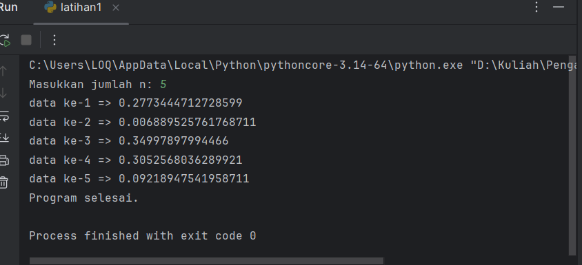
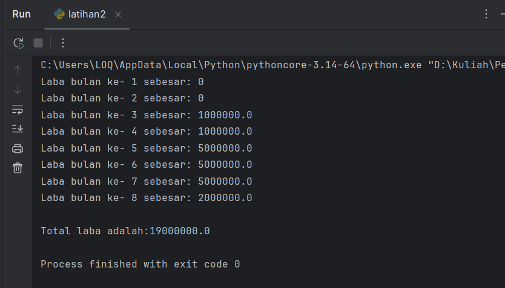
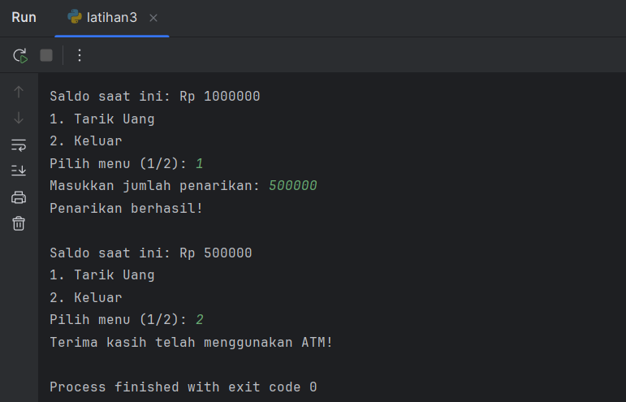

# Penjelasan Latihan 1
## Deskripsi

Program ini digunakan untuk menampilkan sejumlah bilangan acak yang lebih kecil dari 0.5.
Jumlah bilangan (n) dimasukkan oleh pengguna pada saat program dijalankan (runtime).
Program menggunakan kombinasi perulangan while dan for, serta fungsi random() dari modul random.

# Kode Program
```py
from random import random

n = int(input("Masukkan jumlah n: "))  # input jumlah data
jumlah = 0  # penghitung berapa data yang sudah ditampilkan

# selama jumlah data yang ditampilkan masih kurang dari n
while jumlah < n:
    for i in range(1):  # kombinasi dengan for
        angka = random()
        if angka < 0.5:
            jumlah += 1
            print(f"data ke-{jumlah} => {angka}")

print("Program selesai.")
```
## Penjelasan Program

1. **import Fungsi random()**
from random import random digunakan untuk memanggil fungsi random() yang menghasilkan bilangan acak antara 0 hingga 1.
2. **Input Jumlah Data (n)**
Pengguna memasukkan berapa banyak bilangan acak yang ingin ditampilkan.
3. **Inisialisasi Variabel jumlah**
Digunakan sebagai penghitung berapa banyak bilangan acak yang sudah berhasil ditampilkan.
4. **Perulangan while**
Berjalan selama jumlah data yang dicetak masih kurang dari n.
5. **Perulangan for di Dalam while**
Berfungsi sebagai kombinasi perulangan tambahan agar sesuai dengan ketentuan soal.
6. **Kondisi if angka < 0.5**
Hanya bilangan acak yang nilainya kurang dari 0.5 yang akan ditampilkan dan dihitung.
7. **Output Akhir**
Setelah semua bilangan ditampilkan, program menampilkan pesan "Program selesai."

# Hasil Run Program Latihan 1


# Penjelasan latihan 2

## Deskripsi
Program ini menghitung **laba bulanan** dan **total laba** berdasarkan modal awal sebesar Rp100.000.000.  
Perhitungan dilakukan selama **8 bulan**, dengan ketentuan laba yang berbeda-beda di setiap periode waktu.

## Ketentuan Laba
1. **Bulan 1-2:** Tidak ada laba (0%).
2. **Bulan 3-4:** Laba sebesar 1% dari modal.
3. **Bulan 5-7:** Laba sebesar 5% dari modal.
4. **Bulan 8:** Laba sebesar 2% dari modal.

## Kode Program
```python
modal = 100000000
laba_total = 0

for bulan in range(1, 9):
    if bulan <= 2:
        laba = 0
    elif bulan <= 4:
        laba = modal * 0.01
    elif bulan <= 7:
        laba = modal * 0.05
    else:
        laba = modal * 0.02
    
    laba_total += laba
    print(f"Laba bulan ke- {bulan} sebesar: {laba}")

print(f"\nTotal laba adalah: {laba_total}")
```

## Penjelasan Program
1. **Inisialisasi Variabel:**
   - `modal` diisi dengan nilai awal 100.000.000.
   - `laba_total` diisi 0 untuk menyimpan akumulasi laba.

2. **Perulangan `for`:**
   - Digunakan untuk menghitung laba setiap bulan dari bulan ke-1 hingga ke-8.
   - Kondisi `if`, `elif`, dan `else` menentukan besaran laba berdasarkan bulan.

3. **Output:**
   - Menampilkan laba setiap bulan.
   - Menampilkan total laba setelah semua perhitungan selesai.

## Hasil Run Program Latihan 2

---
# Penjelasan latihan 3

## Deskripsi
Program ini mensimulasikan sistem **ATM sederhana** yang memungkinkan pengguna untuk:
1. Melihat saldo saat ini.  
2. Melakukan penarikan uang jika saldo mencukupi.  
3. Keluar dari program kapan saja.

Program ini berjalan terus menggunakan **perulangan `while True`** hingga pengguna memilih menu keluar.
---
---

## Kode Program
```python
saldo = 1000000  # saldo awal

while True:
    print(f"\nSaldo saat ini: Rp {saldo}")
    print("1. Tarik Uang")
    print("2. Keluar")

    pilihan = input("Pilih menu (1/2): ")

    if pilihan == "1":
        tarik = int(input("Masukkan jumlah penarikan: "))

        if tarik > saldo:
            print("Saldo tidak mencukupi!")
        elif tarik <= 0:
            print("Nominal tidak valid!")
        else:
            saldo -= tarik
            print("Penarikan berhasil!")

    elif pilihan == "2":
        print("Terima kasih telah menggunakan ATM!")
        break
    else:
        print("Menu tidak valid, coba lagi.")
```
---
## Penjelasan Program
1. **Inisialisasi Saldo:**
   - Variabel `saldo` diatur ke **1.000.000** sebagai saldo awal.

2. **Perulangan `while True`:**
   - Program terus berjalan hingga pengguna memilih keluar.

3. **Menu Pilihan:**
   - **1. Tarik Uang** → Meminta input jumlah uang yang ingin ditarik.
     - Jika penarikan lebih besar dari saldo → tampil pesan *"Saldo tidak mencukupi!"*  
     - Jika nominal ≤ 0 → tampil pesan *"Nominal tidak valid!"*  
     - Jika valid → saldo dikurangi dan tampil pesan *"Penarikan berhasil!"*  
   - **2. Keluar** → Menghentikan perulangan dan menampilkan pesan *"Terima kasih telah menggunakan ATM!"*

4. **Validasi Input:**  
   - Jika pengguna memasukkan menu selain 1 atau 2, muncul pesan *"Menu tidak valid, coba lagi."*
---
##  Hasil Run Program latihan 3
